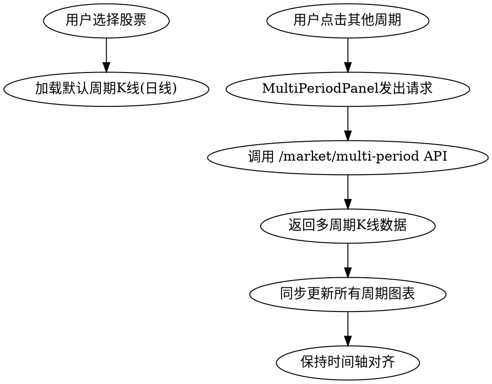
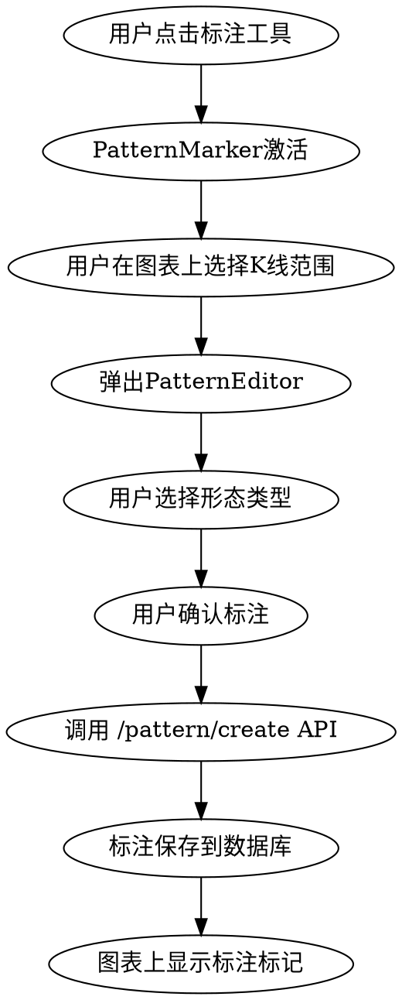
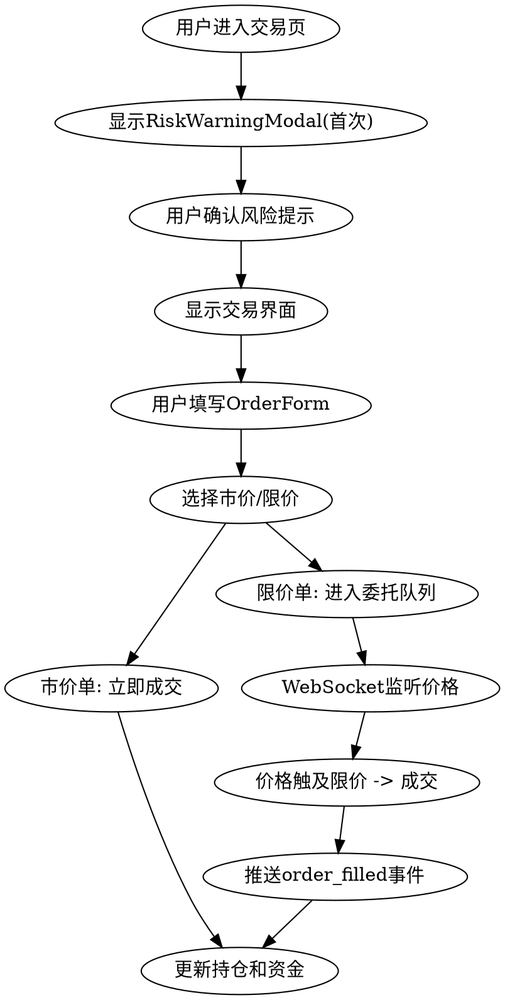

# Pricely MVP 技术设计文档

**版本：** 1.0
**日期：** 2026-03-30
**范围：** MVP核心功能（P0）

---

## 一、项目概述

### 1.1 产品定位

Pricely是国内专注价格行为学的裸K分析+模拟交易+策略复盘工具。核心聚焦K线形态、支撑阻力、趋势结构，摒弃冗余指标与无关功能，为裸K交易者提供专业化、高效化的分析工具。

### 1.2 MVP功能范围

| 功能模块 | 核心能力 |
|----------|----------|
| 极简裸K可视化 | 纯裸K界面、多周期联动、K线样式自定义、OHLC展示 |
| 智能支撑阻力识别 | AI自动识别、斐波那契工具、整数关口标注、手动修正 |
| 基础价格形态标注 | 手动标注经典形态、保存/编辑/删除、关联K线周期 |
| 模拟交易功能 | 市价/限价下单、持仓管理、资金管理、交易报表 |
| 基础交易日志 | 交易记录、分类搜索、复盘查看 |
| 合规风险提示 | 首页、模拟交易页风险提示展示 |

### 1.3 技术选型

| 层级 | 技术 | 选型理由 |
|------|------|----------|
| 前端框架 | React + TypeScript | lightweight-charts集成友好，生态成熟 |
| 图表库 | lightweight-charts | TradingView开源版本，后续迁移成本低 |
| 后端框架 | Python FastAPI | AI生态丰富，异步支持好，类型提示完善 |
| 数据库 | PostgreSQL | 结构化数据存储，支持时序扩展 |
| 缓存 | Redis | 实时行情缓存、会话管理、AI结果缓存 |
| 用户认证 | 自建邮箱系统 | 可控性强，后续扩展OAuth |

### 1.4 MVP阶段特殊约束

| 约束项 | 方案 |
|--------|------|
| **行情数据** | MVP阶段使用历史模拟数据，不接入真实行情源 |
| **AI识别** | MVP阶段使用规则引擎算法，后续迭代升级为ML模型 |

---

## 二、系统架构

### 2.1 整体架构

```
┌─────────────────────────────────────────────────────────────────┐
│                         用户层                                   │
│                    Web Browser (React SPA)                      │
│                    首页风险提示 / 模拟交易页风险提示               │
└─────────────────────────────────────────────────────────────────┘
                              │ HTTPS
                              ▼
┌─────────────────────────────────────────────────────────────────┐
│                         网关层                                   │
│                    Nginx (反向代理 + SSL)                        │
└─────────────────────────────────────────────────────────────────┘
                              │
              ┌───────────────┴───────────────┐
              ▼                               ▼
┌──────────────────────────┐    ┌──────────────────────────┐
│       前端服务            │    │       后端服务            │
│   React + TypeScript     │    │   FastAPI + Python       │
│   lightweight-charts     │    │                          │
│                          │◀───▶│   REST API               │
│   - K线可视化             │    │   - 用户认证              │
│   - 多周期联动            │    │   - 行情数据              │
│   - OHLC信息展示          │    │   - 模拟交易              │
│   - K线样式自定义         │    │   - 交易报表              │
│   - 形态标注工具          │    │   - AI支撑阻力识别        │
│   - 支撑阻力绘制          │    │   - 整数关口标注          │
│   - 模拟交易界面          │    │                          │
│   - 交易报表              │    │                          │
│   - 合规风险提示          │    │                          │
└──────────────────────────┘    └──────────────────────────┘
                                        │
                        ┌───────────────┴───────────────┐
                        ▼                               ▼
              ┌──────────────────┐          ┌──────────────────┐
              │   PostgreSQL     │          │     Redis        │
              │                  │          │                  │
              │ - 用户账户       │          │ - 会话缓存       │
              │ - 交易日志       │          │ - 实时行情缓存   │
              │ - 模拟持仓       │          │ - K线数据缓存    │
              │ - 形态标注       │          │ - AI识别结果缓存 │
              │ - 关联K线周期    │          │                  │
              │ - 模拟资金       │          │                  │
              └──────────────────┘          └──────────────────┘
```

### 2.2 前端模块划分

| 模块 | 功能 | 核心组件 |
|------|------|----------|
| **图表模块** | K线可视化、多周期联动、支撑阻力绘制、OHLC展示、K线样式 | ChartContainer, CandleChart, MultiPeriodPanel, OHLCDisplay, ChartStyleSettings, SupportResistanceTools, FibonacciTools |
| **形态标注模块** | 手动标注价格形态、保存/编辑/删除、关联K线周期 | PatternMarker, PatternList, PatternEditor, PeriodSelector |
| **模拟交易模块** | 市价/限价下单、持仓管理、资金管理、交易报表 | TradePanel, PositionManager, OrderBook, FundManager, TradeReport, OrderForm |
| **交易日志模块** | 交易记录、分类搜索、复盘查看 | TradeLog, LogEntry, LogSearch, LogFilter, LogEditor |
| **用户模块** | 注册、登录、个人信息 | LoginForm, RegisterForm, UserProfile, Settings |
| **合规模块** | 风险提示展示（首页、模拟交易页） | RiskWarningBanner, RiskWarningModal |
| **数据服务模块** | API调用、WebSocket、状态管理 | ApiService, WebSocketService, Store |

### 2.3 后端模块划分

| 模块 | 功能 | 核心 API |
|------|------|----------|
| **认证模块** | 用户注册、登录、JWT令牌 | `/auth/register`, `/auth/login`, `/auth/refresh` |
| **行情模块** | K线数据、实时行情推送、多周期联动 | `/market/kline`, `/market/multi-period`, `/market/realtime`, WebSocket |
| **交易模块** | 模拟下单、持仓查询、资金管理、交易报表 | `/trade/order`, `/trade/position`, `/trade/fund`, `/trade/report` |
| **日志模块** | 交易日志CRUD、分类搜索 | `POST /logs`, `GET /logs`, `PUT /logs/{id}`, `DELETE /logs/{id}` |
| **标注模块** | 形态标注CRUD、关联K线周期 | `POST /patterns`, `GET /patterns`, `GET /patterns/by-period` |
| **AI识别模块** | 支撑阻力自动识别、整数关口标注、识别修正 | `/ai/support-resistance`, `/ai/int-levels`, `/ai/correct-result` |
| **合规模块** | 风险提示内容配置 | `/compliance/risk-warning` |

---

## 三、数据模型

### 3.1 PostgreSQL 核心表

#### 枚举类型定义

```sql
-- K线周期枚举
CREATE TYPE period_enum AS ENUM ('1min', '5min', '15min', '60min', 'daily', 'weekly', 'monthly');

-- 价格形态枚举
CREATE TYPE pattern_enum AS ENUM (
    'pin_bar',           -- Pin Bar
    'engulfing',         -- 吞没形态
    'evening_star',      -- 黄昏星
    'morning_star',      -- 黎明星
    'doji',              -- 十字星
    'head_shoulders_top',    -- 头肩顶
    'head_shoulders_bottom'  -- 头肩底
);

-- 支撑阻力类型枚举（扩展）
CREATE TYPE level_type_enum AS ENUM (
    'support',           -- 水平支撑
    'resistance',        -- 水平阻力
    'trendline',         -- 趋势线
    'channel',           -- 通道线
    'swing_high',        -- 波段高点
    'swing_low'          -- 波段低点
);

-- 订单类型枚举
CREATE TYPE order_type_enum AS ENUM ('buy', 'sell');

-- 订单模式枚举
CREATE TYPE order_mode_enum AS ENUM ('market', 'limit');

-- 订单状态枚举
CREATE TYPE order_status_enum AS ENUM ('pending', 'filled', 'cancelled');

-- 报表周期类型枚举
CREATE TYPE report_period_enum AS ENUM ('daily', 'weekly', 'monthly');
```

#### 用户相关

```sql
-- 用户账户表
CREATE TABLE users (
    id              UUID PRIMARY KEY DEFAULT gen_random_uuid(),
    email           VARCHAR(255) UNIQUE NOT NULL,
    password_hash   VARCHAR(255) NOT NULL,
    nickname        VARCHAR(100),
    created_at      TIMESTAMP DEFAULT CURRENT_TIMESTAMP,
    updated_at      TIMESTAMP DEFAULT CURRENT_TIMESTAMP,
    is_active       BOOLEAN DEFAULT true
);

-- 模拟资金表
CREATE TABLE funds (
    id              UUID PRIMARY KEY DEFAULT gen_random_uuid(),
    user_id         UUID REFERENCES users(id) ON DELETE CASCADE,
    total_balance   DECIMAL(12,2) NOT NULL,      -- 总资产
    available       DECIMAL(12,2) NOT NULL,      -- 可用资金
    frozen          DECIMAL(12,2) DEFAULT 0,     -- 冻结资金（挂单占用）
    initial_capital DECIMAL(12,2) NOT NULL,      -- 初始资金（用于计算收益率）
    updated_at      TIMESTAMP DEFAULT CURRENT_TIMESTAMP
);
```

#### 模拟交易相关

```sql
-- 模拟持仓表
CREATE TABLE positions (
    id              UUID PRIMARY KEY DEFAULT gen_random_uuid(),
    user_id         UUID REFERENCES users(id) ON DELETE CASCADE,
    stock_code      VARCHAR(10) NOT NULL,
    stock_name      VARCHAR(50),
    quantity        INT NOT NULL,
    avg_cost        DECIMAL(10,4) NOT NULL,      -- 平均成本价
    current_price   DECIMAL(10,4),               -- 当前价格（实时更新）
    profit_loss     DECIMAL(12,2),               -- 盈亏金额
    created_at      TIMESTAMP DEFAULT CURRENT_TIMESTAMP,
    updated_at      TIMESTAMP DEFAULT CURRENT_TIMESTAMP
);

-- 模拟订单表
CREATE TABLE orders (
    id              UUID PRIMARY KEY DEFAULT gen_random_uuid(),
    user_id         UUID REFERENCES users(id) ON DELETE CASCADE,
    stock_code      VARCHAR(10) NOT NULL,
    stock_name      VARCHAR(50),
    order_type      order_type_enum NOT NULL,
    order_mode      order_mode_enum NOT NULL,
    limit_price     DECIMAL(10,4),               -- 限价单价格
    quantity        INT NOT NULL,
    filled_price    DECIMAL(10,4),               -- 成交价
    filled_at       TIMESTAMP,                   -- 成交时间
    status          order_status_enum DEFAULT 'pending',
    created_at      TIMESTAMP DEFAULT CURRENT_TIMESTAMP,
    updated_at      TIMESTAMP DEFAULT CURRENT_TIMESTAMP
);

-- 模拟交易报表汇总表
CREATE TABLE trade_reports (
    id              UUID PRIMARY KEY DEFAULT gen_random_uuid(),
    user_id         UUID REFERENCES users(id) ON DELETE CASCADE,
    period_type     report_period_enum NOT NULL,
    period_date     DATE NOT NULL,               -- 统计周期起始日期
    trade_count     INT DEFAULT 0,               -- 交易次数
    win_count       INT DEFAULT 0,               -- 盈利次数
    loss_count      INT DEFAULT 0,               -- 亏损次数
    win_rate        DECIMAL(5,2),                -- 胜率 %
    total_profit    DECIMAL(12,2) DEFAULT 0,     -- 总盈利
    total_loss      DECIMAL(12,2) DEFAULT 0,     -- 总亏损
    net_profit      DECIMAL(12,2) DEFAULT 0,     -- 净盈亏
    max_drawdown    DECIMAL(12,2) DEFAULT 0,     -- 最大回撤
    created_at      TIMESTAMP DEFAULT CURRENT_TIMESTAMP
);
```

#### 交易日志相关

```sql
-- 交易日志表
CREATE TABLE trade_logs (
    id              UUID PRIMARY KEY DEFAULT gen_random_uuid(),
    user_id         UUID REFERENCES users(id) ON DELETE CASCADE,
    stock_code      VARCHAR(10) NOT NULL,
    stock_name      VARCHAR(50),
    period          period_enum NOT NULL,        -- K线周期
    pattern_type    pattern_enum,                -- 形态类型
    entry_price     DECIMAL(10,4) NOT NULL,      -- 入场价
    stop_loss       DECIMAL(10,4),               -- 止损价
    take_profit     DECIMAL(10,4),               -- 止盈价
    exit_price      DECIMAL(10,4),               -- 出场价（实际）
    quantity        INT NOT NULL,
    profit_loss     DECIMAL(12,2),               -- 盈亏金额
    notes           TEXT,                        -- 备注分析
    tags            VARCHAR[],                   -- 分类标签，如 ['突破', '回调']
    trade_time      TIMESTAMP,                   -- 交易时间
    created_at      TIMESTAMP DEFAULT CURRENT_TIMESTAMP,
    updated_at      TIMESTAMP DEFAULT CURRENT_TIMESTAMP
);
```

#### 形态标注相关

```sql
-- 形态标注表
CREATE TABLE pattern_marks (
    id              UUID PRIMARY KEY DEFAULT gen_random_uuid(),
    user_id         UUID REFERENCES users(id) ON DELETE CASCADE,
    stock_code      VARCHAR(10) NOT NULL,
    period          period_enum NOT NULL,        -- 关联K线周期
    pattern_type    pattern_enum NOT NULL,       -- 形态类型
    start_time      TIMESTAMP NOT NULL,          -- 形态起始K线时间
    end_time        TIMESTAMP NOT NULL,          -- 形态结束K线时间
    start_price     DECIMAL(10,4),               -- 形态起始价格
    end_price       DECIMAL(10,4),               -- 形态结束价格
    description     TEXT,                        -- 形态描述
    is_valid        BOOLEAN DEFAULT true,        -- 形态有效性标记
    created_at      TIMESTAMP DEFAULT CURRENT_TIMESTAMP,
    updated_at      TIMESTAMP DEFAULT CURRENT_TIMESTAMP
);
```

#### AI识别结果相关

```sql
-- 支撑阻力识别结果表
CREATE TABLE sr_levels (
    id              UUID PRIMARY KEY DEFAULT gen_random_uuid(),
    stock_code      VARCHAR(10) NOT NULL,
    period          period_enum NOT NULL,
    level_type      level_type_enum NOT NULL,
    level_price     DECIMAL(10,4) NOT NULL,      -- 支撑/阻力价位
    strength        INT,                         -- 强度评分（1-10）
    is_ai_detected  BOOLEAN DEFAULT true,        -- AI自动识别
    is_user_corrected BOOLEAN DEFAULT false,     -- 用户手动修正
    user_id         UUID REFERENCES users(id),   -- NULL if AI detected, 有值 if user corrected
    created_at      TIMESTAMP DEFAULT CURRENT_TIMESTAMP,
    updated_at      TIMESTAMP DEFAULT CURRENT_TIMESTAMP
);

-- 整数关口标注表
CREATE TABLE int_levels (
    id              UUID PRIMARY KEY DEFAULT gen_random_uuid(),
    stock_code      VARCHAR(10) NOT NULL,
    period          period_enum NOT NULL,
    level_price     DECIMAL(10,4) NOT NULL,      -- 整数关口价格，如 10.00, 15.00
    level_type      level_type_enum NOT NULL,
    touches_count   INT DEFAULT 0,               -- 该价位触及次数
    created_at      TIMESTAMP DEFAULT CURRENT_TIMESTAMP
);
```

### 3.2 Redis 缓存结构

| Key 模式 | 用途 | 数据结构 | TTL |
|----------|------|----------|-----|
| `session:{user_id}` | 用户会话 | String (JWT) | 24h |
| `kline:{stock_code}:{period}` | K线数据缓存 | List (JSON数组) | 5min |
| `realtime:{stock_code}` | 实时行情 | Hash (OHLC) | 实时更新 |
| `sr:{stock_code}:{period}` | AI识别支撑阻力结果 | List (JSON) | 1h |
| `int:{stock_code}:{period}` | 整数关口 | List (JSON) | 1h |
| `report:{user_id}:{date}` | 用户日报缓存 | String (JSON) | 1h |

---

## 四、API接口设计

### 4.0 命名规范

| 层级 | 命名风格 | 示例 |
|------|----------|------|
| **数据库** | snake_case | `trade_count`, `win_rate`, `period_type` |
| **API响应** | camelCase | `tradeCount`, `winRate`, `periodType` |
| **API路径** | RESTful复数形式 | `/logs`, `/patterns`, `/orders` |
| **前端TypeScript** | camelCase | 与API响应保持一致 |

**转换规则：** 后端ORM层（SQLAlchemy）负责数据库snake_case到API camelCase的自动转换。

### 4.1 认证模块

| 接口 | 方法 | 说明 | 请求/响应 |
|------|------|------|-----------|
| `/auth/register` | POST | 用户注册 | `{email, password, nickname}` → `{user_id, token}` |
| `/auth/login` | POST | 用户登录 | `{email, password}` → `{user_id, token, refresh_token}` |
| `/auth/refresh` | POST | 刷新令牌 | `{refresh_token}` → `{token}` |
| `/auth/logout` | POST | 登出 | `{token}` → `{success}` |

### 4.2 行情模块

| 接口 | 方法 | 说明 | 请求/响应 |
|------|------|------|-----------|
| `/market/kline` | GET | 获取单周期K线 | `?stock_code=&period=&start=&end=` → `[{time, open, high, low, close}]` |
| `/market/multi-period` | GET | 获取多周期K线（联动） | `?stock_code=&periods=1min,5min,daily` → `{1min: [...], 5min: [...], daily: [...]}` |
| `/market/realtime` | GET | 获取实时行情 | `?stock_code=` → `{price, change, change_pct}` |
| `/market/stocks` | GET | 获取股票列表 | `?keyword=` → `[{code, name}]` |
| `ws://market/stream` | WebSocket | 实时行情推送 | subscribe `{stock_code}` → receive `{price, time}` |

### 4.3 交易模块

| 接口 | 方法 | 说明 | 请求/响应 |
|------|------|------|-----------|
| `/trade/order` | POST | 下单（市价/限价） | `{stock_code, order_type, order_mode, quantity, limit_price?}` → `{order_id, status}` |
| `/trade/order/{id}` | DELETE | 取消未成交订单 | - → `{success}` |
| `/trade/orders` | GET | 查询订单列表 | `?status=pending,filled` → `[{order_id, stock_code, ...}]` |
| `/trade/position` | GET | 查询当前持仓 | - → `[{stock_code, quantity, avg_cost, profit_loss}]` |
| `/trade/fund` | GET | 查询资金信息 | - → `{total, available, frozen, initial}` |
| `/trade/fund/reset` | POST | 重置模拟资金 | `{initial_capital}` → `{success}` |
| `/trade/report` | GET | 查询交易报表 | `?period_type=daily&start=&end=` → `{trade_count, win_rate, net_profit, max_drawdown}` |

### 4.4 日志模块

| 接口 | 方法 | 说明 | 请求/响应 |
|------|------|------|-----------|
| `/logs` | POST | 创建交易日志 | `{stock_code, period, pattern_type, entry_price, ...}` → `{log_id}` |
| `/logs` | GET | 查询日志列表 | `?tags=&stock_code=&start=&end=` → `[{log_id, ...}]` |
| `/logs/{id}` | GET | 查询日志详情 | - → `{日志详情}` |
| `/logs/{id}` | PUT | 更新日志 | `{更新字段}` → `{success}` |
| `/logs/{id}` | DELETE | 删除日志 | - → `{success}` |

### 4.5 标注模块

| 接口 | 方法 | 说明 | 请求/响应 |
|------|------|------|-----------|
| `/patterns` | POST | 创建形态标注 | `{stock_code, period, pattern_type, start_time, ...}` → `{pattern_id}` |
| `/patterns` | GET | 查询标注列表 | `?stock_code=&period=&pattern_type=` → `[{pattern_id, ...}]` |
| `/patterns/{id}` | GET | 查询标注详情 | - → `{标注详情}` |
| `/patterns/{id}` | PUT | 更新标注 | `{更新字段}` → `{success}` |
| `/patterns/{id}` | DELETE | 删除标注 | - → `{success}` |
| `/patterns/by-period` | GET | 按周期查询标注 | `?period=daily` → `[{pattern_id, ...}]` |

### 4.6 AI识别模块

| 接口 | 方法 | 说明 | 请求/响应 |
|------|------|------|-----------|
| `/ai/support-resistance` | POST | 自动识别支撑阻力 | `{stock_code, period, kline_data}` → `[{level_type, price, strength}]` |
| `/ai/int-levels` | GET | 计算整数关口 | `?stock_code=&period=` → `[{price, level_type, touches_count}]` |
| `/ai/correct-result` | POST | 用户修正识别结果 | `{level_id, corrected_price, action}` → `{success}` |

### 4.7 合规模块

| 接口 | 方法 | 说明 | 请求/响应 |
|------|------|------|-----------|
| `/compliance/risk-warning` | GET | 获取风险提示内容 | - → `{title, content}` |

### 4.8 WebSocket 事件

**WebSocket连接地址：** `ws://{host}/ws/market`

| 事件 | 方向 | 说明 |
|------|------|------|
| `subscribe` | Client → Server | 订阅股票行情 `{stock_code}` |
| `unsubscribe` | Client → Server | 取消订阅 `{stock_code}` |
| `price_update` | Server → Client | 价格推送 `{stock_code, price, time}` |
| `kline_update` | Server → Client | K线更新 `{stock_code, period, kline: {time, open, high, low, close}}` |
| `order_filled` | Server → Client | 订单成交通知 `{order_id, filled_price, filled_at}` |

---

## 五、前端组件设计

### 5.1 目录结构

```
src/
├── components/
│   ├── Chart/
│   │   ├── ChartContainer.tsx      # 图表容器，集成lightweight-charts
│   │   ├── CandleChart.tsx         # K线图主体
│   │   ├── OHLCDisplay.tsx         # OHLC信息展示组件
│   │   ├── MultiPeriodPanel.tsx    # 多周期联动面板
│   │   ├── ChartStyleSettings.tsx  # K线样式设置
│   │   ├── SupportResistanceTools.tsx  # 支撑阻力绘制工具栏
│   │   ├── FibonacciTools.tsx      # 斐波那契工具
│   │   └── PriceLevelMarker.tsx    # 价格位标注组件
│   ├── Pattern/
│   │   ├── PatternMarker.tsx       # 形态标注工具
│   │   ├── PatternList.tsx         # 形态列表侧边栏
│   │   ├── PatternEditor.tsx       # 形态编辑弹窗
│   │   └── PeriodSelector.tsx      # K线周期选择器
│   ├── Trade/
│   │   ├── TradePanel.tsx          # 交易面板
│   │   ├── PositionManager.tsx     # 持仓管理组件
│   │   ├── OrderBook.tsx           # 订单列表
│   │   ├── FundManager.tsx         # 资金管理组件
│   │   ├── TradeReport.tsx         # 交易报表组件
│   │   └── OrderForm.tsx           # 下单表单
│   ├── Log/
│   │   ├── TradeLog.tsx            # 交易日志主界面
│   │   ├── LogEntry.tsx            # 单条日志条目
│   │   ├── LogSearch.tsx           # 日志搜索组件
│   │   ├── LogFilter.tsx           # 日志筛选组件
│   │   └── LogEditor.tsx           # 日志编辑弹窗
│   ├── Auth/
│   │   ├── LoginForm.tsx           # 登录表单
│   │   ├── RegisterForm.tsx        # 注册表单
│   │   ├── UserProfile.tsx         # 用户信息页
│   │   └── Settings.tsx            # 用户设置
│   ├── Compliance/
│   │   ├── RiskWarningBanner.tsx   # 风险提示横幅
│   │   ├── RiskWarningModal.tsx    # 风险提示弹窗
│   │   └── WarningContent.tsx      # 提示内容组件
│   └── common/
│       ├── Header.tsx              # 导航栏
│       ├── Sidebar.tsx             # 侧边栏
│       ├── Loading.tsx             # 加载状态
│       ├── Modal.tsx               # 通用弹窗
│       ├── Button.tsx              # 通用按钮
│       └── Input.tsx               # 通用输入框
├── pages/
│   ├── Home.tsx                    # 首页（图表+形态标注）
│   ├── Trade.tsx                   # 模拟交易页面
│   ├── Log.tsx                     # 交易日志页面
│   ├── Report.tsx                  # 报表页面
│   ├── Login.tsx                   # 登录页
│   └── Register.tsx                # 注册页
├── services/
│   ├── api.ts                      # REST API调用封装
│   ├── websocket.ts                # WebSocket连接管理
│   ├── auth.ts                     # 认证相关API
│   ├── market.ts                   # 行情相关API
│   ├── trade.ts                    # 交易相关API
│   ├── log.ts                      # 日志相关API
│   ├── pattern.ts                  # 标注相关API
│   └── ai.ts                       # AI识别相关API
├── stores/
│   ├── userStore.ts                # 用户状态
│   ├── chartStore.ts               # 图表状态
│   ├── tradeStore.ts               # 交易状态
│   ├── logStore.ts                 # 日志状态
│   └── patternStore.ts             # 标注状态
├── hooks/
│   ├── useAuth.ts                  # 认证钩子
│   ├── useChart.ts                 # 图表操作钩子
│   ├── useWebSocket.ts             # WebSocket钩子
│   ├── useTrade.ts                 # 交易操作钩子
│   └── usePattern.ts               # 形态标注钩子
├── utils/
│   ├── chartUtils.ts               # 图表工具函数
│   ├── dateUtils.ts                # 日期处理
│   ├── mathUtils.ts                # 数学计算（斐波那契等）
│   └── validators.ts               # 表单验证
└── types/
    ├── chart.ts                    # 图表相关类型
    ├── trade.ts                    # 交易相关类型
    ├── log.ts                      # 日志相关类型
    ├── pattern.ts                  # 标注相关类型
    └── user.ts                     # 用户相关类型
```

### 5.2 UI设计原则

- **参考TradingView风格**：深色主题为主、简洁工具栏、信息密度适中
- **图表区域为核心**：占据页面主体空间，其他功能面板可收起/展开
- **响应式布局**：适配桌面端与移动端浏览器

---

## 六、部署与安全

### 6.1 部署架构

```
┌─────────────────────────────────────────────────────────────────┐
│                         用户                                     │
│                    Web Browser                                   │
└─────────────────────────────────────────────────────────────────┘
                              │ HTTPS (443)
                              ▼
┌─────────────────────────────────────────────────────────────────┐
│                      Nginx                                       │
│              (反向代理 + SSL + 静态资源)                          │
│                                                                  │
│  - /api/* → 转发到 FastAPI                                       │
│  - /ws/* → WebSocket转发                                         │
│  - /*    → 静态文件服务 (React Build)                            │
└─────────────────────────────────────────────────────────────────┘
                              │
              ┌───────────────┴───────────────┐
              ▼                               ▼
┌──────────────────────────┐    ┌──────────────────────────┐
│       前端容器            │    │       后端容器            │
│   React Build Output     │    │   FastAPI + Uvicorn      │
│   (静态文件)             │    │   (Port 8000)            │
└──────────────────────────┘    └──────────────────────────┘
                                        │
                        ┌───────────────┴───────────────┐
                        ▼                               ▼
              ┌──────────────────┐          ┌──────────────────┐
              │   PostgreSQL     │          │     Redis        │
              │   (Port 5432)    │          │   (Port 6379)    │
              └──────────────────┘          └──────────────────┘
```

### 6.2 部署方案（MVP阶段）

| 服务 | 部署方式 | 说明 |
|------|----------|------|
| **前端** | Docker容器 + Nginx | React构建产物打包为静态文件，Nginx托管 |
| **后端** | Docker容器 | FastAPI + Uvicorn，单实例足够支撑1000用户 |
| **PostgreSQL** | Docker容器或云数据库 | MVP可容器化，后续迁移云数据库 |
| **Redis** | Docker容器 | 缓存服务容器化部署 |
| **Nginx** | Docker容器 | 反向代理、SSL证书、静态资源 |

**推荐云平台：** 阿里云 / 腾讯云（国内用户为主，合规数据源对接便利）

### 6.3 安全设计

#### 认证与授权

| 项目 | 方案 |
|------|------|
| **密码存储** | bcrypt哈希，加盐处理 |
| **JWT令牌** | RS256签名，accessToken有效期2小时，refreshToken有效期7天 |
| **Token刷新** | accessToken过期前5分钟自动刷新 |
| **会话管理** | Redis存储session，支持强制登出 |

#### API安全

| 项目 | 方案 |
|------|------|
| **HTTPS** | 强制HTTPS，SSL证书（Let's Encrypt） |
| **跨域** | CORS白名单，仅允许指定域名 |
| **请求限流** | Redis计数，API限流100 req/min/user |
| **输入验证** | Pydantic严格校验所有输入参数 |
| **SQL注入防护** | SQLAlchemy ORM，禁止原生SQL拼接 |

#### WebSocket安全

| 项目 | 方案 |
|------|------|
| **连接认证** | WebSocket握手时验证JWT |
| **订阅限制** | 单连接订阅股票上限10只 |
| **心跳检测** | 30秒心跳，超时断开 |

#### 数据安全

| 项目 | 方案 |
|------|------|
| **敏感数据加密** | 用户邮箱等敏感字段AES加密存储 |
| **数据库访问** | 禁止root直连，应用账户权限最小化 |
| **备份策略** | 每日自动备份，保留7天 |

### 6.4 错误处理

#### API错误响应格式

```json
{
  "error": {
    "code": "INVALID_STOCK_CODE",
    "message": "股票代码不存在",
    "details": {"stock_code": "ABC123"}
  }
}
```

#### 错误码规范

| 分类 | 错误码示例 |
|------|-----------|
| **认证错误** | `UNAUTHORIZED`, `TOKEN_EXPIRED`, `INVALID_CREDENTIALS` |
| **业务错误** | `INSUFFICIENT_FUND`, `INVALID_STOCK_CODE`, `ORDER_NOT_FOUND` |
| **系统错误** | `INTERNAL_ERROR`, `SERVICE_UNAVAILABLE` |

### 6.5 性能优化策略

| 场景 | 策略 |
|------|------|
| **K线加载** | Redis缓存K线数据，分页加载历史数据（每页500条） |
| **多周期联动** | 并行请求多个周期，减少串行等待 |
| **实时行情** | WebSocket推送，避免轮询 |
| **AI识别** | 结果缓存1小时，相同股票/周期复用 |
| **前端渲染** | 图表组件懒加载，虚拟滚动日志列表 |

---

## 七、核心交互流程

### 7.1 多周期联动流程



### 7.2 形态标注流程



### 7.3 模拟交易流程



---

## 八、后续迭代规划

| 优先级 | 功能 | 预计版本 |
|--------|------|----------|
| **P1** | AI自动价格形态识别（基础版）、多周期共振查看优化 | v1.1 |
| **P2** | 价格行为策略回测系统、专业复盘工具 | v1.2 |
| **P3** | 用户自定义功能扩展、多端同步优化、AI识别精度提升 | v2.0 |

---

## 九、附录

### A. MVP需求完整覆盖清单

| PRD需求 | 设计覆盖 | 状态 |
|---------|----------|------|
| 默认纯裸K界面，仅保留OHLC | OHLCDisplay组件 | ✅ |
| 多周期联动（7个周期） | MultiPeriodPanel + `/market/multi-period` | ✅ |
| K线样式自定义 | ChartStyleSettings组件 | ✅ |
| AI自动识别支撑阻力 | `/ai/support-resistance` API | ✅ |
| 斐波那契回调/扩展工具 | FibonacciTools组件 | ✅ |
| 整数关口标注 | `/ai/int-levels` API | ✅ |
| 手动修正识别结果 | `/ai/correct-result` API | ✅ |
| 手动标注经典形态 | PatternMarker组件 | ✅ |
| 形态保存/编辑/删除 | `/pattern/*` API | ✅ |
| 形态关联K线周期 | PeriodSelector + `/pattern/by-period` | ✅ |
| 市价/限价下单 | OrderForm组件 | ✅ |
| 模拟资金管理 | FundManager组件 | ✅ |
| 交易记录/持仓查看 | PositionManager组件 | ✅ |
| 模拟交易报表 | TradeReport + `/trade/report` | ✅ |
| 交易日志记录 | TradeLog组件 | ✅ |
| 日志分类/搜索 | LogSearch/LogFilter组件 | ✅ |
| 合规风险提示 | RiskWarningBanner/Modal | ✅ |

### B. 技术栈版本推荐

| 技术 | 推荐版本 |
|------|----------|
| React | 18.x |
| TypeScript | 5.x |
| lightweight-charts | 4.x |
| FastAPI | 0.100+ |
| Python | 3.11+ |
| PostgreSQL | 15.x |
| Redis | 7.x |
| SQLAlchemy | 2.x |
| Pydantic | 2.x |

---

## 十、MVP阶段技术方案补充

### 10.1 模拟行情数据方案

#### 数据来源

MVP阶段使用**预置历史数据文件**，不接入真实行情源：

| 数据项 | 来源 | 格式 |
|--------|------|------|
| K线历史数据 | CSV文件预置 | `{time, open, high, low, close}` |
| 实时行情模拟 | 后端定时生成 | 基于最新K线价格随机波动 |
| 股票列表 | 预置JSON文件 | `{code, name, exchange}` |

#### 数据加载流程

```
┌─────────────────┐     ┌─────────────────┐     ┌─────────────────┐
│  CSV数据文件    │────▶│  后端启动加载   │────▶│  Redis缓存      │
│  (data/klines/) │     │  入PostgreSQL   │     │  (热点数据)     │
└─────────────────┘     └─────────────────┘     └─────────────────┘
```

#### 实时行情模拟机制

```python
# 模拟实时价格波动（每秒更新）
def simulate_realtime_price(base_price: float) -> float:
    # 随机波动范围 ±0.5%
    fluctuation = random.uniform(-0.005, 0.005)
    return round(base_price * (1 + fluctuation), 4)

# WebSocket推送频率：每3秒推送一次模拟价格
```

#### 预置数据规模

| 数据类型 | 范围 | 数据量 |
|----------|------|--------|
| 股票列表 | A股热门50只 | 50条 |
| K线历史 | 每只股票2年日线 | ~50,000条 |
| 多周期K线 | 7个周期 | ~350,000条 |

---

### 10.2 AI支撑阻力识别技术方案

#### MVP阶段方案：规则引擎算法

MVP阶段采用**纯规则算法**，不使用ML模型，原因：
1. 开发周期短，无需训练数据
2. 算法透明可解释，便于调试
3. 响应速度快，满足2秒要求

#### 支撑阻力识别算法逻辑

```python
def identify_support_resistance(klines: List[Kline]) -> List[Level]:
    levels = []

    # 1. 波段高低点识别（局部极值）
    swing_points = find_swing_points(klines, window=5)
    for point in swing_points:
        levels.append({
            'level_type': 'swing_high' if point.is_high else 'swing_low',
            'price': point.price,
            'strength': calculate_strength(point)
        })

    # 2. 水平支撑阻力（多次触及价位）
    horizontal_levels = find_horizontal_levels(klines, tolerance=0.02)
    for level in horizontal_levels:
        levels.append({
            'level_type': 'support' if level.is_support else 'resistance',
            'price': level.price,
            'strength': level.touches_count
        })

    # 3. 整数关口识别
    int_levels = find_integer_levels(klines)
    for level in int_levels:
        levels.append({
            'level_type': 'support' if level.is_support else 'resistance',
            'price': level.price,
            'strength': level.touches_count
        })

    return levels

def find_swing_points(klines, window=5):
    """识别波段高低点：当前K线的高/低点高于/低于前后window根K线"""
    swing_points = []
    for i in range(window, len(klines) - window):
        # 波段高点
        if klines[i].high == max([k.high for k in klines[i-window:i+window+1]]):
            swing_points.append(SwingPoint(klines[i].time, klines[i].high, is_high=True))
        # 波段低点
        if klines[i].low == min([k.low for k in klines[i-window:i+window+1]]):
            swing_points.append(SwingPoint(klines[i].time, klines[i].low, is_high=False))
    return swing_points

def find_horizontal_levels(klines, tolerance=0.02):
    """识别水平支撑阻力：价格多次触及（±tolerance范围内）"""
    # 聚类相近价位，计算触及次数
    ...

def find_integer_levels(klines):
    """识别整数关口：如10.00, 15.00, 20.00"""
    # 统计价格触及整数位的次数
    ...
```

#### 强度评分规则

| 因素 | 评分权重 |
|------|----------|
| 触及次数 | 每次触及 +2分，上限10分 |
| 最近触及时间 | 最近10根K线内触及 +3分 |
| 价格距离当前价 | 距离越近权重越高 |

---

### 10.3 斐波那契工具交互逻辑

#### 用户操作流程

```
1. 用户点击斐波那契工具按钮 → FibonacciTools激活
2. 用户在图表上选择两个点：
   - 点A：波段高点或波段低点（需用户手动选择）
   - 点B：波段低点或波段高点（需用户手动选择）
3. 系统自动计算斐波那契回调/扩展比例
4. 在图表上绘制斐波那契线
5. 用户可调整比例参数（默认：0.236, 0.382, 0.5, 0.618, 0.786）
```

#### 斐波那契计算逻辑

```python
def calculate_fibonacci_levels(point_a: float, point_b: float, ratios: List[float]):
    """
    计算斐波那契回调位
    point_a: 波段高点（上升趋势）或波段低点（下降趋势）
    point_b: 波段低点（上升趋势）或波段高点（下降趋势）
    """
    diff = abs(point_a - point_b)
    levels = {}
    for ratio in ratios:
        if point_a > point_b:  # 上升趋势，回调向下
            levels[ratio] = point_b + diff * ratio
        else:  # 下降趋势，回调向上
            levels[ratio] = point_a + diff * ratio
    return levels
```

---

### 10.4 限价单撮合逻辑

#### 撮合触发机制

MVP阶段使用**K线收盘价触发**，不使用Tick数据：

```
┌─────────────────┐
│  WebSocket推送  │
│  (每3秒模拟)    │
└────────┬────────┘
         │
         ▼
┌─────────────────┐
│  检查限价单队列 │
│  pending orders │
└────────┬────────┘
         │
         ▼
┌─────────────────┐     ┌─────────────────┐
│ 当前价格触及    │────▶│  撮合成交       │
│ 限价单价格？    │ Yes │  filled_price   │
└────────┬────────┘     └─────────────────┘
         │ No
         ▼
┌─────────────────┐
│  继续等待       │
└─────────────────┘
```

#### 撮合价格确定规则

| 场景 | 撮合价格 |
|------|----------|
| 买入限价单 | 当前价格 ≤ 限价价格时，以当前价格成交 |
| 卖出限价单 | 当前价格 ≥ 限价价格时，以当前价格成交 |
| 涨跌停无法成交 | 订单保持pending状态，返回提示 |

#### 撮合检查频率

- **触发时机**：每次WebSocket价格推送时检查（每3秒）
- **检查范围**：所有pending状态的限价单

---

### 10.5 交易报表计算逻辑

#### 报表生成时机

| 报表类型 | 生成时机 |
|----------|----------|
| 日报 | 每日凌晨0:05定时任务生成前一日报表 |
| 周报 | 每周一凌晨0:05生成上周报表 |
| 月报 | 每月1日凌晨0:05生成上月报表 |

#### 最大回撤计算公式

```python
def calculate_max_drawdown(trade_records: List[TradeRecord]) -> float:
    """
    最大回撤 = (峰值 - 谷值) / 峰值
    基于每日净资产曲线计算
    """
    net_values = [record.net_value for record in trade_records]
    peak = net_values[0]
    max_dd = 0

    for value in net_values:
        if value > peak:
            peak = value
        drawdown = (peak - value) / peak
        if drawdown > max_dd:
            max_dd = drawdown

    return round(max_dd * 100, 2)  # 返回百分比
```

#### 胜率计算

```python
win_rate = (win_count / trade_count) * 100
```

---

### 10.6 模拟资金初始化

#### 初始化规则

| 项目 | 规则 |
|------|------|
| **初始资金** | 用户注册时自动分配 ¥100,000 |
| **资金重置** | 用户可在设置中重置，自定义初始金额（范围 ¥10,000 - ¥1,000,000） |
| **首次登录提示** | 弹窗提示"模拟资金已初始化，初始资金¥100,000" |

#### 用户注册流程（补充）

```
用户注册成功 → 自动创建funds记录 → initial_capital=100000, total_balance=100000
```